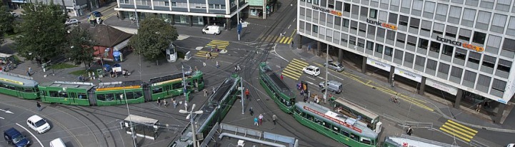

# Mobility Explorer v0.4.0

Aufgrund der erhöhten individuellen Mobilität und der Zunahme des öffentlichen Verkehrs werden Planung und Lenkung der Mobilität immer wichtiger. MobEx leistet zu diesem Thema einen Beitrag und erlaubt die numerische und grafische Analyse des motorisierten und des Langsamverkehrs in Basel Stadt. Die Daten stammen von automatisierten Zählstellen, betrieben vom [Bau- Verkehrsdepartement](https://www.bvd.bs.ch/) des Kantons Basel. Sie werden von der [Fachstelle für Open Gouvernment Data (OGD)](https://data.bs.ch/pages/home/) in auswertefreundlicher Form tagesaktuell publiziert.

