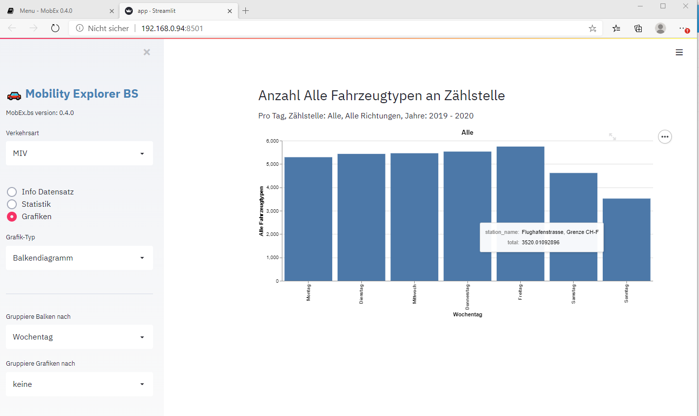
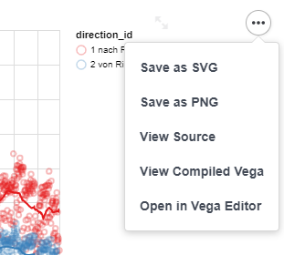

# Übersicht

Die Benutzerschnittstelle der Applikation *MobEx.bs* besteht aus einem Navigationsbereich (linker Rahmen) und einem Hauptbereich auf welchem Grafiken und Tabellen dargestellt werden.

Der Navigationsbereich kann über das [x] Element in der oberen rechten Ecke eingeklappt werden, was mehr Platz für den Hauptbereich schafft und insbesondere bei Geräten mit kleinem Bildschirm, wie Tablets oder Mobil-Telefonen, nützlich sein kann.

Die Programmsteuerung erfolgt über die Wahl der Verkehrsart (Motorisierter Individualverkehr, Velos oder Fussgänger) sowie den drei Menu-Optionen:
- Info: Kurzinfo zum Datensatz
- Statistik: Tabelle der Zählstellen mit Mittel- und Maximalwert des ausgewählten Parameters und innerhalb des ausgewühlten Zeitintervalls
- Grafiken: Erstellung von verschiedenen Grafiken (Balkendiagrammen, Zeitreihen, Heatmap oder Karten)

Grafiken können als PNG oder SVG Dateien gespeichet werden. Dazu wird mit dem [...] Symbol im oberen rechten Ecken der Grafik ein Untermenu aufgeklappt, welches die entsprechenden Optionen enthält.

Auch Tabellen haben eine Schaltfläche in der oberen rechten Ecke. Diese erscheint, wenn der Mauszeiger in diesem Bereich bewegt wird. Das Drücken dieser Schaltfläche bewirkt die grossformatige Darstellung der Tabelle auf einer eigenen Seite. Tabellen haben zudem im Fussbereich einen Download-Link, über welchen die Daten im CSV-Format (Komma-separierte Textdatei) heruntergeladen- und lokal weiterverarbeitet werden können.

## Navigationsbereich
Der Navigationsbereich enthält folgende Elemente
- Verkehrsart: erlaubt es zwischen den Datensätzen `Motorisierter Individualverkehr`, `Velos` und `Fussgänger` zu wechseln
- Menu: Auswahl der Ausgabe im Hauptbereich: Info und Metadaten zum Datensatz, Statistik, Grafik
- Grafiktyp (nur angzeigt für Ausgabetyp Grafik): Balkendiagram, Karte, Zeitreihe, Heatmap 
- Gruppierung: die Gruppierung legt fest, welche Spalte zur Darstellung von Symbolen oder Balken verwendet wird. Zum Beispiel kann festgelegt werden, dass im Balkendiagramm jeder Balken den Mittelwert der Fahrzeugmessungen für ein Jahr darstellen soll. Mit der Gruppierung der Grafiken können multiple Grafiken in einem Schritt erzeugt werden, z.B. kann eine Grafik pro Zählstelle oder pro Jahr erstellt werden.
- Parameter für Analyse: diese Option wird nur für die Motorfahrzeuge angezeigt, da nur für sie verschiedene Fahrzeugtypen unterschieden werden können (Motorräder, Personenewagen, Lieferwagen, Lastwagen, Sattelschlepper, Busse, andere sowie Total und Kombinationen dieser Typen). Bei Velos und Fussgängern wird immer nur ein einziger Wert gemessen und die Option erübrigt sich.
- Zeitliche Aggregation der Messungen: die Auflösung der Messwerte im Stundenintervall ist in der Regel für eine Darstellung zu hoch, daher können die Messwerte zeitlich zu Tages- oder Wochensummen addiert werden. 
- Filter: In der Regel wird in einer Grafik oder Tabelle nur ein Teil der Daten benötigt, die Auswahl wird über die Filterfelder gesteuert.
    - Zählstelle: Messstelle
    - Richtung: erlaubt es, bei einer ausgewählten Zählstelle mit mehreren Richtungen nur eine Richtung auszuwählen
    - Nach Datum Filtern, von/bis Datum: Beschränkt die Auswahl der Daten auf das definierte Intervall mit Start und Enddatum.
    - Auswahl Zeit: Erlaubt die Auswahl eines Zeitintervalls, z.B. wenn Statistik über Stosszeiten am Morgen oder am Abend erstellt werden sollen. Damit ein Zeitintervall definiert werden kann muss zuerst die `Nach Datum Filtern` Checkbox ausgewählt werden. Die unten aufgeführten weiteren Filter stehen nur zur Verfügung, wenn kein Datumsintervall gesetzt wurde.
    - Wochentag: Eingrenzen auf alle Messwerte, die an einem definierten Wochentag gemessen wurden
    - Werktage/Wochentage: Eingrenzen auf alle Messwerte, die an einem Wochentag oder am Wochenende gemessen wurden
    - Auswahl Woche: Eingrenzen auf alle Messwerte, die in einer definierten Kalenderwoche (1-53) gemessen wurden
    - Auswahl Monat: Eingrenzen auf alle Messwerte, die in einem definierten Monat (1-12) gemessen wurden
    - Auswahl Jahr: Eingrenzen auf alle Messwerte, die in einem definierten Jahresintervall gemessen wurde. 
    - Auswahl Zeit: Eingrenzen auf die Tageszeit, welche im Filter berücksichtigt werden soll. 

Ist man an den Werten eines bestimmten Zeitintervalls interessiert, so lohnt es sich, die Filter für das Zeitintervall möglichst früh zu setzen. Während der Verarbeitung eines Befehls erscheint in der oberen rechten Ecke des Browser-Fensters ein animiertes Icon mit einer *Stop* Schaltfläche über welche der Vorgang abgebrochen werden kann, um anschliessend einen Filter zu setzen oder die richtige Zählstelle auszuwählen etc.

Im Menu Grafik werden zudem kontextabhängig Grafikoptionen angezeigt:
- Minimum und Maximum der Achsen: Mit dieser Option kann die automatisch berechneten Start- und Endwerte der Achsen gesteuert werden. Dies erweist sich als nützlich, wenn z.B. wenn über ide Grafik-Gruppierung mehrere Grafiken vom gleichen Typ erzeugt werden, und die Resultate vergleichbar sein sollen. 
- Achsen Länge: Grafiken weitereverwendet werden sollen, so kann es nützlich sein, die Defaultwerte der Grafikgrösse zu übersteuern.

