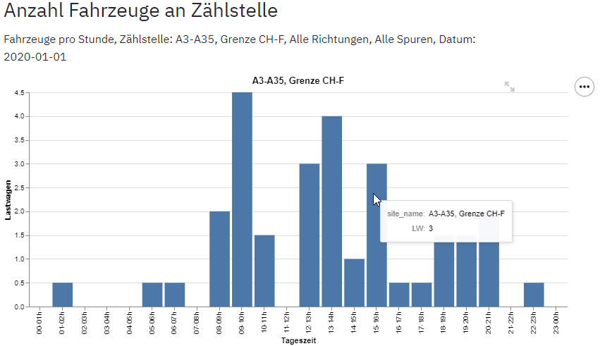
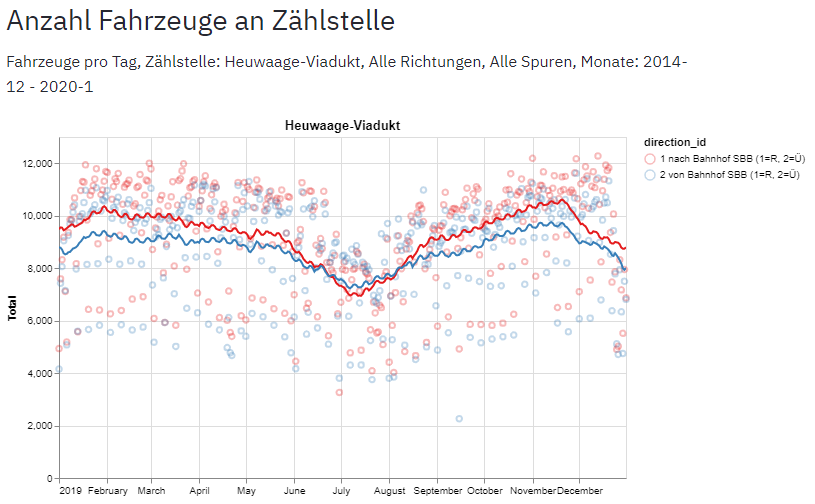

# Menu
Dieses Kapitel beschreibt die Verwendung der Menu-Optionen der Applikation **MobEx**.

## Info Datensatz
Diese Menu-Option wird beim Öffnen der Webseite dargestellt und enthält einige Basis-Informationen über den beiden Datensätzen Motorisierter Individiualverkehr und Langsamverkehr, sowie die Links zum Dateneigner und zur [Fachstelle OGD](https://www.opendata.bs.ch/), welche die Daten publiziert. 

## Statistiken
Diese Menu Option erstellt eine einfache Tabelle mit Mittel- und Maximalwerten, sowie mit den täglichen Minimum und Maximumwerten. Die Grundeinstellung zeigt eine Tabelle für alle Zählstellen und alle verfügbaren Daten. Über die Option `Zeitliche Aggregation der Messung` wird gesteuert ob die Mittel/Maximalwerte pro Woche, pro Stunde oder pro Tag ausgegeben werden. Über die Option `Gruppierung Tabelle nach` können für verschiedene Parameter eigene Tabellen pro Ausprägung dieses Parameters erstellt werden. Wird zum Beispiel über das Attribut Jahr gruppiert, so wird für jedes Jahr eine eigene Tabelle erstellt, wird über den Wochentag gruppiert, so entsteht eine Tabelle für jeden Wochentag etc.

Die Standardeinstellung stellt beim MIV das Total der Fahrzeuge dar, mit dem Feld Parmaeter für Analyse kann jedoch auch ein spezifischer Fahrzeugtyp ausgewählt werden.

Mit den verschiedenen Filter-Feldern kann zudem der verwendete Wertbereich eingeschränkt werden. Möchte man eine Tabelle erstellen, welche die Verkehrsdaten von 2017 bis 2018 berücksichtigt, so kann dieses Zeitintervall mit dem Filter *Auswahl Jahr* bewerkstelligt werden:

Die Statistik wird für einen definierten Parameter (Alle Fahrzeuge, Personenwagen, Lastwagen etc., oder Fussgänger, Velo für Langsamverkehr) ausgegeben, welcher im Navigationsbereich mit der Auwahlliste `Parameter` ausgewählt werden kann. Unter jeder Tabelle erscheint der Link "als csv Datei herunterladen* über welchen die Daten der Tabelle als Datei lokal gespeichert werden können. Am einfachsten wendet man den Rechtsklick an und wählt im Kontextmenu die Option `Link speichern unter`. So lässt sich die Datei in einem Schritt am gewünschten Ort ablegen, während ein Linksklick die Datei automatisch im Download Verzeichns abspeichert, von wo man sie anschliessend in das Zielverzeichnis verschieben und umbenennen kann.

Mit der Option *Gruppiere Tabellen nach* in Navigationsbereich, können mehrere Statistik-Tabellen generiert werden, wobei jede Tabelle nach einem Wert der Gruppierung gefiltert ist. Wird zum Beipiel nach Jahr gruppiert, so wird eine Tabelle pro Zählstelle und Jahr erzeugt.

## Grafiken
Grafiken ist in der Regel die wichtigste Menuoption und erlaubt die Darstellung der Daten in verschiedenen Grafiktypen. Der Grafiktyp wird in der Auswahlliste `Grafik-Typ` unterhalb des Menus ausgewählt. Es stehen folgende Typen zur Verfügung: 
- Balkendiagramm
- Karte
- Zeitreihe
Jede Grafik besitzt zwei Kontrollelemente in der rechten oberen Ecke: 

erlaubt die Anzeige der vergrösserten Grafik auf einer eigenen Seite.

erlaubt das Speichern einer Grafik im PNG- oder SVG-Format.

Im untersten Teil des Navigationsbereichs können zudem im Bereich Grafikeinstellung Minmum und Maximum der Achsen sowie die Grafik Höhe und Breite definiert werden. Achsen-Minimum und -Maximum sind vor allem wichtig, wenn mit der Gruppier Funktion mehrere Grafiken erzeugt werden und die erzeugten Grafiken möglichst einfach vergleichbar sein sollten. 

### Balkendiagramm
Ein Balkendiagramm zeigt durchschnittliche Wochen, Tages oder Stunden-Werte für eine Zählstelle. Je nach Problemstellung können die Balken im Diagramm über verschiedene Parameter aggregiert werden. So wird in den folgenden Grafiken das mittlere Verkehrsaufkommen pro Jahr dargestellt, und in der darauffolgenden Figur das mittlere Aufkommen pro Wochentag. Der Text unterhalb des Titels dokumentiert die verwendeten Filter. So wurde für die Aggregation pro Jahr nur die Jahre 2015-2019 berücksichtigt.

Im letzten Beispiel wird die durchschnittliche Anzahl der Lastwagen pro Stunde über einen Tagesverlauf an der Zählstelle dargestellt. Wenn Daten nach Tageszeiten gefiltert oder gruppiert werden ist es wichtig, die zeitliche Aggregation der Messungen auf `Fahrzeuge pro Stunde` zu setzen. Die Balken des Diagramms sind interaktiv, fährt man mit dem Maus über einen Balken, so wird der Wert der Y-Achse als Zahl dargestellt.

### Karte
Die räumliche Darstellung der Verkehrsdaten zeigen die Position der einzelnen Messstellen und erlaubt einen visuellen Vergleich aller Messtellen. Der durchschnittliche Anzahl Fahrzeuge oder Personen pro Stunde oder Tag werden angezeigt, wenn man mit dem Zeiger über eine Zählstelle fährt. Wie bei den übrigen Grafiktypen das Zeitintervall, für welches der Durchschnitt gerechnet wird, über die Filterfelder definiert werden. Möchte man z.b. die Werte eines bestimmten Tages wissen, so trägt man das entsprechende Datum im Feld Datum ein (als von und bis Datum werden identische Tage gewählt). Die Symbole einer Karte sind interaktiv, fährt man mit dem Mauszeiger über ein Symbol, so wird der Name der Zählstelle sowie der assozierte Wert in einer Box dargestellt.

### Zeitreihe
Die Zeitreihe zeigt die zeitliche Entwicklung des Verkehrsaufkommens an einer Messstelle. Die Gruppierung der Symbole ist bei Zeitreihen die Kombination von Zählstelle und Richtung. Hat eine Fahrtrichtung mehrere Spuren, so werden diese Werte addiert. Das folgende Beispiel zeigt einen Tagesverlauf der Zählstelle Heuwaage mit einem ausgeprägten Peak bei der Richtung Binningen -> Basel um 6:00 und einem zweiten Peak bei der Richtung Basel -> Binningen um 16:00.

Zeitreihen mit stündlichen Werten wirken bei längeren Zeitintervallen schnell überladen. Bei Monats- oder gar Jahres Intervallen muss daher die zeitliche Aggregation auf tägliche Werte gesetzt werden, sodass pro Tag nur ein, statt 24 Symbole erscheinen.

Bei jährlichen Intervallen erscheinen die Zeitreihen-Grafiken trotz der Verwendung von täglichen Werten unübersichtlich. Hier kann der gleitende Durchschnitt Abhilfe schaffen. Dazu ist im Feld *Gleitender Durchschnitt, Fenster in Tagen* ein Intervall in Tagen anzugeben. Die Tageswerte erscheinen immer noch, sind aber leicht transparent und nicht mehr durch eine Linie verbunden und treten damit in den Hintergrund. Zusätzlich wird pro Fahrtrichtung eine Linie dargestellt, welche als Y Wert den Durchschnitt der Werte innerhalb des Zeitfesters darstellt. Zum Beispiel wird bei einem Zeitfenster von 30 Tagen für jeden Tag der Durchschnitt der vorgangenen 15 Tage und der kommenden 15 Tage abgebildet. Je grösser das Zeitfenster desto mehr wirkt die Kurve geglättet. Damit können längerfristige Trends aufgezeigt werden wie z.B. in der untenenstehenden Figur die Inversion des Verkehrsaufkommens wobei vor dem Monat Juli der Verkehr Richtung Bahnhof höher ist, und nach dem Monat Juli der Verkehr Richtung Binningen höher. Dieser Trend liesse sich basierend auf den als Punkte dargestellten Einzelwerten in nicht gleichermassen klar erkennen.

### Heatmap
*Eine Heatmap ist ein Diagramm zur Visualisierung von Daten aufgrund einer Funktion (Mathematik), mit der eine zweidimensionale Definitionsmenge (z. B. die Punkte einer Hauswand oder einer Landkarte) auf den Zahlenstrahl (z. B. die Skala eines Thermometers) abgebildet und farblich dargestellt werden. Diese Visualisierung dient dazu, in einer grossen Datenmenge intuitiv und schnell einen Überblick zu geben und besonders markante Werte leicht erkennbar zu machen* (Wikipedia). In MobEx wird pro Zeile im Diagramm eine Zählstelle dargestellt, die Spalten sind benutzerdefiniert z.B. Jahr, Monat, Woche, oder Tageszeit und der dar in jeder Zelle dargestellte Wert ist entweder Anzahl Fahrezeuge, Velos oder Fusssgänger pro Stude oder pro Tag.  Möchte man die Fluktuation des Verkehrs über einen längeren Beobachtungszeitraum darstellen, so wählt man unter *Gruppiere Spalten nach* den Eintrag Jahr, sodass jede Zelle den Wert *Durchschnittliche Anzahl Fahrzeuge* an der Zählstelle der Zeile und dem Jahr der Spalte enthält. Fährt man mit dem Mauszeiger über eine Zelle, so wird der Wert numerisch angezeigt. Mit den Zeitfiltern (Datum, Monat, Jahr) lässt sich die Analyse auf ein bestimmtes Zeitintervall begrenzen.

Bei Heatmaps ist die Gruppierung nach Grafik besonders nützlich. In untenstehender Darstellung sind z.B. die Spalten nach Tageszeit gruppiert, die Grafiken nach Wochentag. In dieser Konfiguration lässt sich visuell rasch eruieren, an welchen Tageszeiten und Wochentagen der Verkehr bei welchen Zählstellen besonders hoch oder tief ist. Wie bei den übrigen Grafiktypen wird empfohlen, die Skalierung der Farbe für alle Grafiken zu fixieren, indem das Feld *Farb-Skala Maxiumum* gesetzt wird. Damit wird sichergestellt, dass ein ähnlicher Farbton in zwei Grafiken auch einen ähnlichen Wert bedeutet.

